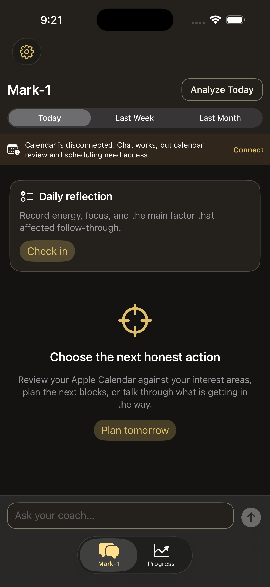

# Mark-1

Mark-1 is a privacy-conscious iOS planning coach built around Apple Calendar.
It reads the calendars already available to the iPhone, helps the user record
what was Complete or Incomplete, finds repeated likely misses, and proposes
safe future planning blocks. Calendar writes require an explicit confirmation
and are performed on-device through EventKit.

The repository ships with five neutral, configurable calendar categories:

- Work
- Study
- Exercise
- Appointments
- Errands

> **Current support status:** this is a single-user project, not a hosted
> multi-user service. The supported production AI path sends OpenAI requests
> through a small FastAPI backend deployed on Railway. Gemini data-use
> guidance is included for future provider work, but Gemini is not currently
> selectable in the production iPhone app.

## App preview

<p align="center">
  
</p>

<p align="center">
  <em>A fresh simulator install with Calendar access disabled.</em>
</p>

## What the app does

- Reads the latest Apple Calendar state at launch and whenever the app returns
  to the foreground.
- Shows all visible non-holiday events for today.
- Reviews Today, the last completed week, or the last completed month.
- Treats an eligible ended event that the user did not mark as 70% likely
  incomplete for deterministic missed-pattern analysis. An explicit Complete
  or Incomplete choice always wins.
- Displays repeated likely misses from the previous seven days without using
  an LLM for that calculation.
- Sends that bounded evidence to the model only when the user requests AI
  analysis and has enabled AI data consent.
- Returns exactly seven review suggestions, or none if the complete batch
  cannot pass deterministic safety checks.
- Adds the full suggestion batch to the default writable Apple Calendar only
  after the user taps the confirmation button.
- Can copy an explicitly Incomplete timed event into the earliest safe slot
  later today, or tomorrow when today has no fit.
- Offers up to three local evening accountability prompts. They begin at
  7:30 PM, with later prompts 40 or 60 minutes apart.

The visible tabs are **Mark-1** and **Progress**. Internal source names still
use `Coach*` and `CalendarAgent`; those are implementation names, not
additional products.

## Apple Calendar setup

No second Apple Account, dedicated calendar, CalDAV server, or invitation flow
is required. Grant full Calendar access on the iPhone. EventKit reads every
calendar already visible in Apple Calendar and writes confirmed events to the
device's normal default writable calendar. If that calendar is stored in
iCloud, Apple syncs it normally.

Apple Calendar remains authoritative. If an event is edited in Apple Calendar,
Mark-1 reads the new value on its next foreground refresh. The model never
receives Apple credentials and never performs a calendar write.

See [Apple Calendar behavior](docs/apple-calendar.md) for the detailed rules.

## Architecture and safety boundary

```text
Apple Calendar
      <-> EventKit on iPhone
      -> minimized context after explicit AI consent
      <-> HTTPS + deployment secret
      <-> stateless FastAPI backend
      <-> configured OpenAI Responses API model (store=false)

Model suggestions
      -> deterministic iPhone validation
      -> one user confirmation
      -> EventKit writes to the default writable calendar
```

The backend is required for hosted frontier models because embedding a
billable provider API key in an iOS binary is not secure. Calendar display,
completion choices, progress, conflict checks, and confirmed writes remain
on-device. AI analysis requires a network connection.

The production Railway deployment is intentionally stateless and does not
require PostgreSQL. The deployment secret is a bearer credential for one
personal installation; it is not a multi-user authentication system. Every
user should deploy a separate backend and use a separate secret and provider
key.

## Privacy and model data use

The app's **AI Data Sharing** switch controls whether the app may send context.
It does not change a model provider's training or retention policy.

| Destination | Data |
| --- | --- |
| Stays on the iPhone | Apple/iCloud credentials, Keychain values, calendar account names, locations, attendees, event notes, raw EventKit identifiers, calendar writes, completion records, and progress data |
| Sent to the user's backend for an AI turn | The typed message, up to 12 recent chat messages, selected calendar categories, planning boundaries, time zone/current time, tracking start, pseudonymous event hashes, and the bounded calendar context needed for that turn |
| Sent onward to the model | Message/history/preferences and title-free future busy times; an explicit analysis also includes relevant titles, times, Complete/Incomplete evidence, and ranked missed-pattern counts |

The prompt builder removes the device identifier and pseudonymous calendar and
event identifiers before calling the model. Notes are currently hidden and are
not included in model requests. The application does not log prompts, chat
text, calendar titles, request bodies, headers, or secrets. Infrastructure and
provider policies still apply.

### Public-repository privacy

This public copy contains only generic Railway, OpenAI, and Gemini references.
It contains no real deployment domain, Railway project/service identifier,
OpenAI or Gemini organization/project identifier, API key, app secret, Apple
Team ID, personal bundle identifier, maintainer name/email/phone, Calendar
export, event screenshot, device log, or absolute home-directory path. Example
values use `localhost`, `com.example.*`, or angle-bracket placeholders.

Do not commit any value substituted for those placeholders. Keep real values
in the ignored `backend/.env`, Railway's encrypted Variables, Xcode's local
signing configuration, and the app's Keychain-backed settings. Before making a
public commit, review the complete staged diff and enable the Git host's secret
scanning. No additional AI or model-hosting provider is configured or
recommended by this repository.

### Hosted frontier-lab models

Before sending private calendar context to any hosted provider, verify the
current API/business data controls for the exact organization, project, tier,
endpoint, and optional features being used. Turning training off is different
from zero retention.

**OpenAI API (supported):** OpenAI states that API inputs and outputs are not
used to train its models by default unless the API organization explicitly
opts in. In OpenAI Platform, an organization owner should open
**Settings → Organization → Data controls** and keep input/output sharing and
evaluation/fine-tuning sharing disabled. This backend passes `store=false`
to the Responses API. That avoids Responses application-state storage for the
request, but it does not by itself provide Zero Data Retention or eliminate
default abuse-monitoring retention. Eligible organizations can apply for
Modified Abuse Monitoring or Zero Data Retention.

- [OpenAI API data controls and retention](https://developers.openai.com/api/docs/guides/your-data)
- [OpenAI API data-sharing controls](https://help.openai.com/en/articles/10306912-sharing-feedback-evaluation-and-fine-tuning-data-and-api-inputs-and-outputs-with-openai)
- [OpenAI organization data controls](https://platform.openai.com/settings/organization/data-controls)

**Gemini API (not currently supported in production):** do not send personal
calendar content through an unpaid Gemini API project. Google's current terms
allow unpaid-service prompts and responses to be used to improve products and
machine-learning technologies and to be reviewed by humans. If a future
adapter is added, use a Cloud project with billing enabled, verify that Google
AI Studio marks the project as **Paid**, and re-check the terms. Paid services
have different data-use terms, but may still retain limited data for abuse
prevention; grounding features can have additional retention.

- [Gemini API Additional Terms](https://ai.google.dev/gemini-api/terms)
- [Gemini API billing and paid-plan verification](https://ai.google.dev/gemini-api/docs/billing)
- [Gemini API pricing and data-use comparison](https://ai.google.dev/gemini-api/docs/pricing)

Privacy wording last verified: **2026-08-09**. Provider policies can change.

## Choose a setup

| Goal | Setup |
| --- | --- |
| Develop in an iOS Simulator | Run the FastAPI backend on the Mac with `make dev`; no Docker or deployment secret is required |
| Use Mark-1 anywhere on a physical iPhone | Deploy the stateless backend to Railway, then sign and install the iOS app |

## Prerequisites

- macOS with Git
- Xcode with an iOS 17 or newer SDK
- [uv](https://docs.astral.sh/uv/) for the Python backend
- an OpenAI API project with billing/usage limits suitable for testing
- for a physical phone: an iPhone running iOS 17 or newer and an Apple Account
- for anywhere/anytime AI: a Railway account

Docker is optional. It is needed only for PostgreSQL audit testing and the
container smoke tests, not for normal simulator development or the supported
stateless Railway deployment.

## Local simulator quick start

1. Clone the repository and enter it:

   ```bash
   git clone <your-fork-or-repository-url> calendar-agent
   cd calendar-agent
   ```

2. Create the ignored development environment file:

   ```bash
   cp backend/.env.example backend/.env
   ```

3. Edit `backend/.env`:

   - keep `ENVIRONMENT=development`;
   - set `OPENAI_API_KEY` to a dedicated development project key;
   - set `OPENAI_MODEL` to a model available to that project that supports
     the Responses API and structured output;
   - keep `ALLOW_BYOK=false` and `AUDIT_PERSISTENCE_ENABLED=false`.

   Never commit `backend/.env`.

4. Install dependencies and start the backend:

   ```bash
   make setup
   make dev
   ```

   Keep that terminal running. The server listens at
   `http://127.0.0.1:8000/api/v1`, which matches the Debug simulator
   configuration.

5. Open `ios/CalendarAgent/CalendarAgent.xcodeproj` in Xcode, select the
   `CalendarAgent` scheme and an installed iPhone simulator, then Run.

6. In the app:

   - open the gear icon and grant full Calendar access;
   - select the calendar categories you want;
   - open **Advanced settings → AI Data Sharing** and enable
     **I consent to sending selected context**;
   - optionally enable **Evening accountability prompts**.

No app secret is required for the loopback simulator backend.

To test optional PostgreSQL audit persistence, start Docker Desktop first,
then set `AUDIT_PERSISTENCE_ENABLED=true` and run:

```bash
make docker-up
make migrate
make dev
```

## Run on a physical iPhone

A phone cannot use the Mac's `127.0.0.1` backend when it is away from the
Mac. For use on Wi-Fi or cellular anywhere, first deploy a persistent HTTPS
backend and then install a signed build.

### 1. Deploy the backend

The supported reference deployment is Railway:

1. Push your fork to a Git host that Railway can access.
2. Create a Railway project from that repository.
3. Set the service **Root Directory** to `/backend`.
4. Set **Config File Path** to `/backend/railway.json`.
5. Do not add PostgreSQL for the stateless personal deployment.
6. Generate an app secret locally:

   ```bash
   openssl rand -base64 48
   ```

7. Add these Railway variables, marking both secrets as sensitive:

   | Variable | Value |
   | --- | --- |
   | `ENVIRONMENT` | `production` |
   | `OPENAI_API_KEY` | a dedicated OpenAI project key |
   | `OPENAI_MODEL` | an available Responses/structured-output model |
   | `APP_SHARED_SECRET` | the generated secret |
   | `ALLOW_BYOK` | `false` |
   | `AUDIT_PERSISTENCE_ENABLED` | `false` |
   | `CORS_ORIGINS` | `[]` |

   Do not define `DATABASE_URL` and do not put any secret in a tracked file.

8. Deploy and generate a public `https://*.up.railway.app` domain.
   `*.railway.internal` is private Railway networking and cannot be reached
   from an iPhone.
9. Do not manually define `PORT`. Railway injects it and the container binds
   to `0.0.0.0:$PORT`. If Railway asks for a domain target port, use the
   detected listening port shown in the deployment logs rather than guessing.
10. Verify liveness:

   ```bash
   curl --fail-with-body https://<your-public-domain>/api/v1/health
   ```

Opening the bare domain root and seeing `404 Not Found` is expected; the API
lives under `/api/v1`. The protected `/api/v1/status` endpoint should
return `401` without the matching `X-App-Secret`.

Follow the full [Railway deployment guide](docs/deployment.md) and
[production checklist](docs/production-checklist.md) before relying on the
service.

### 2. Sign and install the app

The public project intentionally contains no Apple Development Team:

1. In Xcode, add your Apple Account under **Xcode → Settings → Accounts**.
2. Open `ios/CalendarAgent/CalendarAgent.xcodeproj`.
3. Select the `CalendarAgent` target, open **Signing & Capabilities**, keep
   automatic signing enabled, and select your own Team.
4. Replace the example app bundle identifier with a globally unique reverse-DNS
   identifier owned by you. Give the test target a matching unique suffix if
   Xcode asks.
5. Connect and unlock the iPhone, trust the Mac, and enable Developer Mode when
   iOS requests it.
6. Select the physical iPhone as the run destination and press Run.
7. Launch the app once, disconnect the cable, and confirm it launches by
   itself.

A free Apple **Personal Team** is sufficient for testing on your own phone,
but Apple says its provisioning profiles expire after seven days; rebuild and
reinstall after expiration. Use the paid Apple Developer Program with
TestFlight or App Store distribution for durable installation.

- [Apple Personal Team limits](https://developer.apple.com/help/account/basics/about-your-developer-account)
- [Detailed physical-iPhone guide](docs/physical-iphone.md)

### 3. Configure the installed app

1. Tap the gear icon in the top-left.
2. Tap **Advanced settings**.
3. Under **Hosted AI Backend**, enter the public Railway HTTPS URL.
4. Enter `APP_SHARED_SECRET` in **Deployment app secret**, tap
   **Save app secret**, then tap **Verify secure connection**.
5. Confirm the provider is **OpenAI · server managed**, the configured model
   appears, and audit storage is **Stateless**.
6. In **AI Data Sharing**, enable
   **I consent to sending selected context**. Without this consent, AI turns
   are intentionally blocked.
7. Optionally enable **Evening accountability prompts**.
8. Return to the main Settings screen, grant full Calendar access, select
   calendar categories, and adjust planning boundaries.
9. Return to **Mark-1** and run **Analyze Today** using non-sensitive test
   events before relying on the app.

The OpenAI key never belongs in the iPhone app. Only the separate deployment
secret is stored there, using device-only Keychain accessibility.

## Troubleshooting

| Symptom | Check |
| --- | --- |
| Docker cannot connect to its socket | Start Docker Desktop, or skip Docker when using the normal stateless setup |
| Xcode cannot find the named simulator | Run `xcrun simctl list devices available` and override `IOS_TEST_DESTINATION` with an installed simulator ID |
| Railway root URL says `Not Found` | Expected at `/`; use `/api/v1/health` |
| iPhone cannot reach `*.railway.internal` | Use the generated public HTTPS `*.up.railway.app` domain |
| Railway says application failed to respond | Confirm the service binds `0.0.0.0:$PORT` and the public domain targets that actual port |
| Status or coach request returns `401` | Save the exact same `APP_SHARED_SECRET` in Railway and the app |
| Coach request returns `502` | Use the request ID to inspect sanitized Railway logs; check model access, provider billing/limits, key validity, and structured-output compatibility |
| AI controls appear to do nothing | Enable **Advanced settings → AI Data Sharing** |
| Calendar is empty or writes fail | Restore full Calendar access in iOS Settings, then foreground Mark-1 |
| Notifications do not arrive | Re-enable notifications in iOS Settings and toggle the prompts off/on in Advanced settings |
| Personal-Team build no longer opens | Rebuild and reinstall from Xcode after the seven-day provisioning profile expires |

## Development checks

```bash
make test                # backend pytest suite with coverage gate
make lint                # Ruff plus strict mypy
make format-check        # non-mutating format verification
make docker-build        # production container build
make docker-smoke        # injected-PORT health smoke test
make ios-build           # unsigned simulator build
make ios-test            # XCTest on an available simulator
make ios-release-build   # unsigned generic-device Release build
```

If the default simulator is unavailable:

```bash
xcrun simctl list devices available
make ios-test \
  IOS_TEST_DESTINATION='platform=iOS Simulator,id=<simulator-udid>'
```

## Repository map

- `ios/CalendarAgent/` — SwiftUI, EventKit, SwiftData, and Keychain app
- `backend/` — stateless FastAPI provider gateway and scheduling policy
- `docs/` — architecture, calendar, security, deployment, and phone guides

Start with [architecture](docs/architecture.md), [security](docs/security.md),
and the [roadmap](docs/roadmap.md).

## Contributing and security

Keep API keys, app secrets, signing identities, Calendar exports, screenshots,
logs with event content, and local `.env` files out of Git. Tests should use
synthetic calendar data. Security reports should not include real calendar
titles or credentials.

Before accepting a behavior change, update the relevant documentation, write a
failing test where practical, implement the smallest change, and record the
validation in the pull request. See [AGENTS.md](AGENTS.md) for repository rules.

## License

Mark-1 is available under the [MIT License](LICENSE).
